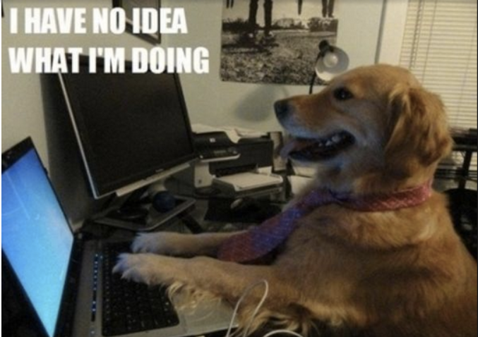

# ☕️ Reality Coffee Shop



[More development ideas here](./devnotes)

# models and credits
- ["Classic Red Coffee Mug"](https://skfb.ly/6Xtw6) by [@hungry_beagle](https://sketchfab.com/hungry_beagle) licensed under [CC BY 4.0](https://creativecommons.org/licenses/by/4.0/)
- Some design may be inspired by [Vhite Rabbit's](https://constructarcade.com/developer/vhite-rabbit/) [Barista Express](https://constructarcade.com/game/barista-express/), although I will be using react three fiber instead of A-Frame.
([All models](./src/models))

# setup from scratch
```
# get the basic react app up
$ brew install node
$ npm install -g npm@latest
$ npm install --global yarn
$ yarn create react-app . --template typescript # skip this step if you are using this repo as-is
$ yarn start

# add React 3D engine (fiber), VR/MR integration, helpers for fiber, physics (cannon)
yarn add three
yarn add react-three-fiber
yarn add @react-three/xr
yarn add @react-three/drei
yarn add @react-three/cannon
```

# local run
```
yarn run serve
```

# to-do list
* learn physics engine and three.js fundamentals
* add textures (async load with react suspense)
* load coffee mug model into scene
* learn xr permission and controller state hooks. Interactivity with fly and orbit controls.
* menu planning (seasonal)
